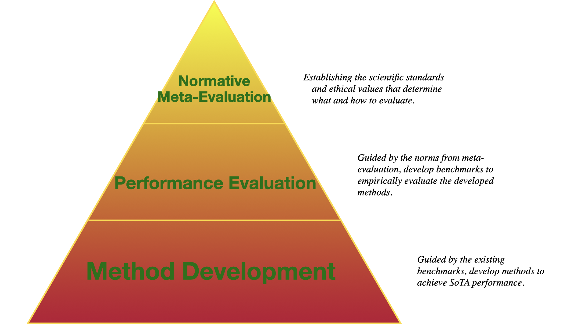

I am Haiwen Huang, my Chinese name is 黄海文. I am a PhD student at University of Tübingen, co-supervised by [Prof. Andreas Geiger](http://www.cvlibs.net/) and [Dr. Dan Zhang](https://www.bosch-ai.com/research/researcher-pages/t_overviewpage_133.html), starting in Jan. 2022. I am also an [ELLIS PhD student](https://ellis.eu/phd-postdoc).

My PhD research focuses on **improving the generalization of vision and multimodal models**, enabling them to perform robustly across diverse tasks and domains. For example, I have developed methods that leverage 3D priors to enhance 2D object detection in [GOOD](https://openreview.net/forum?id=W-nZDQyuy8D) (ICLR 2023) and use self-distillation to upsample features in Vision Foundation Models in [LoftUp](https://arxiv.org/abs/2504.14032) (ICCV 2025). I have also contributed to building more reliable evaluations of open-vocabulary generalization in [RENOVATE](https://openreview.net/forum?id=Uw2eJOI822&referrer=%5Bthe%20profile%20of%20Andreas%20Geiger%5D) (NeurIPS 2024). 
For an overview, you can check out my slides([Latest research slides](https://docs.google.com/presentation/d/1O2wcaQ4Y04jP6ayo4Eecb60zF7RdBtJhfpCLFQrN0g8/edit?usp=sharing)) for the [Computer Vision course](https://uni-tuebingen.de/fakultaeten/mathematisch-naturwissenschaftliche-fakultaet/fachbereiche/informatik/lehrstuehle/autonomous-vision/lectures/computer-vision/) at University of Tuebingen.
I am also hornered to receive [NeurIPS 2024 Top Reviewer Award](https://neurips.cc/Conferences/2024/ProgramCommittee#top-reviewers) and [CVPR 2025 Outstanding Reviewer Award](https://cvpr.thecvf.com/Conferences/2025/ProgramCommittee#all-outstanding-reviewer)，

I envision my work through a three-tiered “research pyramid”: (1) Method Development, (2) Performance Evaluation, and (3) Normative Meta-Evaluation. My PhD projects focus on the first two levels, but my long-term goal is to address all three to ensure that AI truly benefits society.

🔴 **News**:
- Sept. 2025: Our follow-up work on [feature upsampling for interactive segmentation](https://www.arxiv.org/abs/2505.02075) got selected as an **oral presentation** at the [Instance-Level Recognition and Generation (ILR+G) Workshop](https://iccv.thecvf.com/virtual/2025/workshop/2744) at ICCV 2025.
- July 2025: [LoftUp](https://andrehuang.github.io/loftup-site/) is selected as an **oral presentation** at ICCV 2025!
- June 2025: [LoftUp](https://andrehuang.github.io/loftup-site/) is accepted to ICCV 2025!
- April 2025: I will be starting an internship in _Google Zurich_ from July 2025.

Before my PhD studies, I completed my MSc in CS at University of Oxford, advised by [Prof. Yarin Gal](http://www.cs.ox.ac.uk/people/yarin.gal/website/), and my undergrad study in Mathematics at Peking University, advised by [Prof. Bin Dong](https://bicmr.pku.edu.cn/~dongbin/). I have also worked as a researcher for a year at Megvii (previously known as Face++) with [Xinyu Zhou](https://scholar.google.com/citations?user=Jv4LCj8AAAAJ&hl=en) as my group leader, studying large-scale annotation and OoD detection methods. 

My CV is [here](https://docs.google.com/document/d/1_7xy0SveFSQaMOPqbib2nQu1LWaDiPq_/edit?usp=sharing&ouid=106089829124619974563&rtpof=true&sd=true).

Highlighted Research 
==

* **[LoftUp: Learning a Coordinate-Based Feature Upsampler for Vision Foundation Models](https://arxiv.org/abs/2504.14032)**
  * Haiwen Huang, Anpei Chen, Volodymyr Havrylov, Andreas Geiger, Dan Zhang
  * ICCV 2025 **(oral)**.
  * [Code](https://github.com/andrehuang/loftup), [Project Page](https://andrehuang.github.io/loftup-site/)

* **[Renovating Names in Open-Vocabulary Segmentation Benchmarks](https://arxiv.org/abs/2403.09593)**
  * Haiwen Huang, Songyou Peng, Dan Zhang, Andreas Geiger
  * NeurIPS 2024.
  * [OpenReview](https://openreview.net/forum?id=Uw2eJOI822&referrer=%5Bthe%20profile%20of%20Andreas%20Geiger%5D), [Project Page](https://andrehuang.github.io/renovate/)

* Multimodal Dataset Upgrading: a New Challenge for Data Annotation
   * Haiwen Huang, Dan Zhang, Andreas Geiger
   * ICLR 2024 [DPFM workshop](https://sites.google.com/view/dpfm-iclr24/call-for-paper?authuser=0)
   * [Paper](https://openreview.net/forum?id=XLkl9OsF8G&referrer=%5Bthe%20profile%20of%20Andreas%20Geiger%5D)

 
* **[GOOD: Exploring Geometric Cues for Detecting Objects in an Open World](https://arxiv.org/abs/2212.11720)**
  * **Haiwen Huang**, Andreas Geiger, Dan Zhang
  * ICLR 2023.
  * [OpenReview](https://openreview.net/forum?id=W-nZDQyuy8D), [Code](https://github.com/autonomousvision/good)
  

* **[Decomposing Representations for Deterministic Uncertainty Estimation](https://arxiv.org/abs/2112.00856)**
  * **Haiwen Huang**, Joost van Amersfoort, Yarin Gal
  * 6th Bayesian Deep Learning workshop at NeurIPS 2021. 
  * [Poster](https://andrehuang.github.io/files/decomp_poster.png)

* **[Feature Space Singularity for Out-of-distribution Detection](https://arxiv.org/abs/2011.14654)**
  * **Haiwen Huang**, Zhihan Li, Lulu Wang, Sishuo Chen, Xinyu Zhou, Bin Dong
  * Safe AI 2021 workshop at AAAI-21. 
  * [Code](https://github.com/megvii-research/FSSD_OoD_Detection), [Poster](https://andrehuang.github.io/files/fssd-poster.pdf)

Teaching
==
* [Computer Vision](https://uni-tuebingen.de/fakultaeten/mathematisch-naturwissenschaftliche-fakultaet/fachbereiche/informatik/lehrstuehle/autonomous-vision/lectures/computer-vision/) (summer term 2023)
* [Seminar: Large-scale Generative Models: Prospects and Limitations](https://uni-tuebingen.de/fakultaeten/mathematisch-naturwissenschaftliche-fakultaet/fachbereiche/informatik/lehrstuehle/sicheres-deep-learning/teaching/) (summer term 2023)
